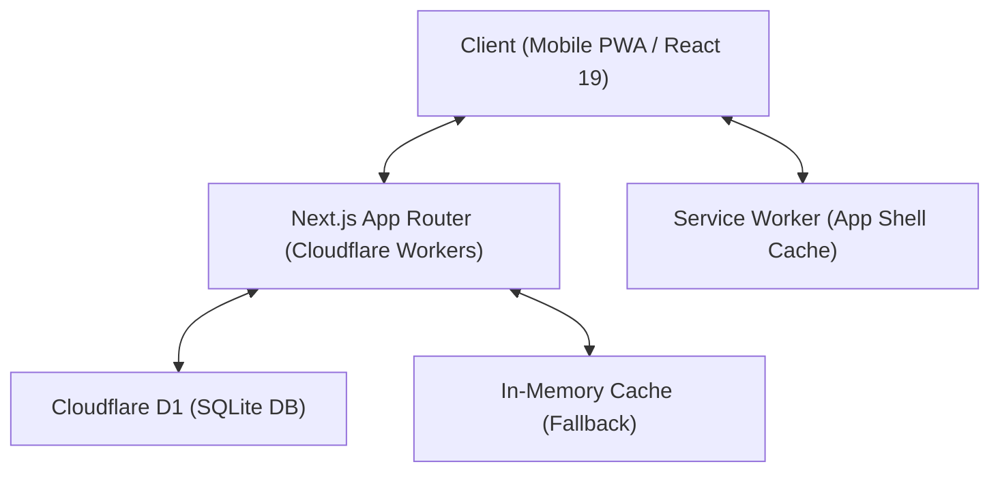

# 🎲 Dubipoly 프로젝트 종합 점검 보고서 & 협업 가이드

> **문서 버전:** 1.0.0  
> **점검 일시:** 2026-09-14  
> **대상:** 프로젝트 협업자(개발자 및 AI 어시스턴트)  

---

## 1. 프로젝트 개요 및 기획 의도

- **프로젝트명:** Dubipoly (두비폴리)
- **목적:** 한국인/페루인 커플을 위한 프라이빗 2인용 모바일 웹 보드게임 (부루마블/모노폴리 스타일)
- **주요 테마 & 아트:**
  - 마스코트: 고양이 **두부(Dubu)** (투명 배경 캐릭터 일러스트가 보드 중앙 및 프로필에 적용됨)
  - 게임 내 화폐: **두비(Dubi)**
  - 밝고 아기자기한 여행 컨셉 (한국 14개 도시 + 페루 14개 도시)
- **지원 언어:** 영어(`en`, 기본값), 한국어(`ko`), 스페인어(`es`) 3개 국어 완벽 지원 및 실시간 변경 가능
- **플랫폼:** 모바일 웹 우선(Mobile-first), PWA(Progressive Web App) 설치 지원

---

## 2. 기술 스택 및 아키텍처



| 영역 | 기술 스택 | 설명 |
| :--- | :--- | :--- |
| **Frontend** | React 19.2.8, TypeScript, Tailwind CSS v4 | Next.js App Router 호환 Vite RSC 엔진(`vinext`) 활용 |
| **UI Components** | shadcn/ui, Lucide Icons | 모바일 터치 및 반응형 UI 완비 |
| **Backend** | Cloudflare Workers, Wrangler | Edge 환경에서 경량 API 라우트 실행 |
| **Database** | Cloudflare D1 (분산 SQLite) | 룸 스냅샷 및 접속 상태(`presence`) 영속화 |
| **State Engine** | Pure Functional State Machine | `lib/game.ts` - 액션 저널 리플레이 기반 순수 함수 엔진 |
| **PWA** | Service Worker (`public/sw.js`) | 앱 셸 캐싱, 오프라인 화면 표시 |

---

## 3. 핵심 아키텍처 & 설계 원칙

### 3.1. 순수 함수형 게임 엔진 (`lib/game.ts`)
- **저널 기반 리플레이(Save/Replay Journal):**  
  게임 상태는 임의의 상태 변조를 방지하기 위해 `names`와 유효한 `actions` 리스트만 저장하며, 복원 시 `restore()` 함수를 통해 초기 상태부터 순수 함수(`transition`)로 100% 재현(Replay)합니다.
- **불변성(Immutability):**  
  모든 턴 진행과 상태 변화는 이전 객체를 직접 변경하지 않고 새로운 상태 객체를 반환합니다.

### 3.2. 네트워크 멱등성 및 동시성 제어 (`lib/server-rooms.ts`)
- **2자리 룸 코드:** 방 코드가 `00`~`99` 숫자로 단순화되어 모바일에서 쉽게 입력하고 공유 가능합니다.
- **멱등성 (`requestId`):** 클라이언트가 주사위 굴리기, 구매, 업그레이드 등 요청 시 고유한 `requestId`를 생성하여 전송합니다. 서버는 이미 처리된 요청인 경우 이전 결과를 그대로 반환하여 중복 처리를 방지합니다.
- **낙관적 동시성 제어 (CAS / Compare-And-Swap):**  
  `dubipoly_rooms` 테이블의 `updated_at` 컬럼을 버전 번호처럼 사용하여, 동시 요청 시 나중에 도착한 요청은 충돌(409 Conflict) 처리하고 클라이언트 상태 갱신을 유도합니다.
- **하트비트 분리 (`dubipoly_presence`):**  
  플레이어의 주기적 접속 확인(5초 주기)은 게임 상태 테이블을 락하지 않도록 `dubipoly_presence` 테이블로 분리 저장됩니다.
- **스마트 폴링 (204 No Content 지원):**  
  클라이언트가 최신 `matchId`와 `revision`을 헤더/쿼리로 전송하며, 변경 사항이 없을 경우 서버는 `204 No Content`로 응답하여 대역폭과 연산량을 절약합니다.

---

## 4. 보드 구성 및 게임 규칙

### 4.1. 보드 맵 구성 (총 40칸)
- **1 ~ 20번 칸 (한국):**
  - 광주, 전주, 대전, 수원, 경주(관광지), 춘천, 강릉, 속초, 대구, 부산, 인천, 제주(관광지), 서울 등
  - **20번 칸 (코너):** 휴식처 (Rest / 무인도)
- **21 ~ 40번 칸 (페루):**
  - Iquitos, Puno, Arequipa, Trujillo, Chiclayo, Huaraz, Ica, Paracas, Piura(관광지), Huancayo, Tarapoto, Cusco(관광지), Lima 등
  - **30번 칸 (코너):** 여행 지연 (Travel Delay - 20번 휴식처로 강제 송환)
  - **40번 칸 (코너):** 출발점 (Start - 통과 시 200 Dubi 지급)
- **이벤트 칸 (8칸):** 12가지 다국어 이벤트 카드 (축제, 세금, 추가 이동 등, 연쇄 이동 방지 포함)

### 4.2. 최신 스페셜 룰 (Stage 10~12 구현 내용)
1. **주사위 더블 (Doubles):**
   - 두 주사위 눈이 같으면 턴 종료 후 **추가 주사위(Extra Roll)** 기회 부여
   - 연속 3회 더블 발생 시 즉시 이동 없이 20번 휴식처로 강제 이동 (출발 보너스 없음)
2. **휴식처 및 여행 지연 (Rest & Travel Delay):**
   - 30번 '여행 지연' 칸에 걸리거나 3연속 더블 시 20번 '휴식처'로 이동되어 갇힘(`restTurns`)
   - 탈출 조건:
     - (1) 더블 주사위를 굴려 즉시 탈출 (이 경우 추가 롤 없음)
     - (2) 보석금/휴식비 50 Dubi 지불 후 일반 주사위로 이동
     - (3) 3회 연속 탈출 실패 시 3회째 50 Dubi 강제 지불 후 해당 눈금만큼 이동
3. **관광지 (Tourist Destinations - 4곳):**
   - 한국: 경주, 제주 / 페루: Cusco, Piura
   - 일반 도시와 달리 업그레이드가 불가능하며, 한 플레이어가 소유한 관광지 개수에 따라 통행료가 배수로 증가 (`25 × 2^(소유개수-1)`)
4. **지역 독점 (Regional Monopoly):**
   - 동일 지역(예: 한국 수도권, 페루 안데스 등)의 모든 도시를 독점하면, 건물이 없는 기본 상태(level 0)의 통행료가 2배로 증가

---

## 5. 전체 시스템 점검 결과

| 점검 항목 | 결과 | 상세 내용 |
| :--- | :---: | :--- |
| **테스트 스위트 (`npm test`)** | ✅ **통과 (29/29)** | 100회 랜덤 시뮬레이션, 장애 주입(Fault injection), 동시성 락, 룸 플로우, 스페셜 룰 전체 통과 |
| **타입 안정성 (`tsc --noEmit`)** | ✅ **통과 (0 errors)** | 전체 TypeScript 정적 타입 검사 완벽 통과 |
| **프로덕션 빌드 (`npm run build`)** | ✅ **통과** | Vinext(Vite) RSC, SSR, 클라이언트 번들링 성공 |
| **린터 (`oxlint`)** | ⚠️ **경고** | 소스 코드는 정상이나, 아카이브 디렉토리(`package-stage*`)가 린트 범위에 포함되어 대량 에러 감지됨. (`.oxlintrc.json` 수정 권장) |
| **Git 작업 트리 상태** | ⚠️ **미커밋 변경 다수** | Stage 10~12 스페셜 룰 및 D1 presence 분리 등 **1,854줄 추가 / 475줄 삭제**가 Uncommitted 상태 |

---

## 6. 주요 디렉토리 및 파일 가이드

```
MobilePoly/
├── app/
│   ├── api/rooms/
│   │   ├── route.ts                 # 방 생성/참여/상태 조회/닉네임 변경 API
│   │   └── [roomCode]/actions/
│   │       └── route.ts             # 게임 액션(주사위, 구매, 업그레이드, 턴종료, 보석금) API
│   ├── globals.css                  # Tailwind v4 글로벌 스타일 및 반응형 레이아웃
│   ├── layout.tsx                   # 메타데이터, 뷰포트, PWA 매니페스트 링크
│   └── page.tsx                     # 메인 단일 페이지 (보드, 컨트롤, 방 모달, PWA/오프라인)
├── lib/
│   ├── board.ts                     # 40개 칸 상세 정보(도시명, 지역, 국기, 가격, 렌트비)
│   ├── events.ts                    # 12종 이벤트 카드 정의
│   ├── game.ts                      # 순수 함수형 게임 룰/엔진 (주사위, 자산, 이동, 파산, 리플레이)
│   ├── game-copy.ts                 # 3개 국어(KO, EN, ES) UI 텍스트 및 로그 메시지
│   ├── room.ts                      # URL 기반 룸 파라미터 파싱 및 공유 URL 생성
│   └── server-rooms.ts              # D1/메모리 방 저장소, CAS 동시성 제어, 하트비트
├── db/
│   └── schema.ts                    # D1 테이블 메타정보
├── drizzle/
│   ├── 0000_create_rooms.sql        # dubipoly_rooms 테이블 생성
│   └── 0001_room_presence.sql       # dubipoly_presence 테이블 생성
├── tests/
│   ├── board.test.ts                # 보드 데이터 무결성 검증
│   ├── game.test.ts                 # 단일 기기 룰 엔진 및 100회 시뮬레이션
│   ├── server-rooms.test.ts         # 방 스토리지 및 CAS 락 테스트
│   ├── rooms-flow.test.ts           # 2인 온라인 플로우 및 장애 주입 통합 테스트
│   └── special-rules.test.ts        # 더블, 휴식처, 관광지, 독점 룰 검증
└── public/
    ├── sw.js                        # PWA 서비스 워커 (앱 셸 캐싱)
    ├── dubu.png                     # 마스코트 두부 캐릭터 에셋
    └── manifest.webmanifest         # PWA 매니페스트
```

---

## 7. 협업 시 필수 작업 가이드 & 팁

### 7.1. 로컬 개발 및 테스트 실행법
```bash
# 1. 의존성 설치
npm ci

# 2. 로컬 개발 서버 시작 (동일 Wi-Fi의 모바일 테스트를 위해 0.0.0.0 바인딩)
npm run dev -- --host 0.0.0.0

# 3. 테스트 실행 (29개 테스트 전체 검증)
npm test

# 4. 프로덕션 빌드 검증
npm run build
```

### 7.2. 협업 전 우선 권장 작업 (Next Steps)
1. **Git Commit 정리 (중요):**
   - 현재 작업 트리에 있는 변경사항(스페셜 룰, presence 마이그레이션 등)은 모든 테스트와 빌드가 통과하는 매우 안정된 상태입니다.
   - 기능별 또는 스테이지(Stage 10~12) 단위로 깔끔하게 커밋하여 GitHub 원격 저장소에 push해두는 것을 권장합니다.
2. **`.oxlintrc.json` 보완:**
   - `ignorePatterns`에 `"package-stage*/**"` 추가하여 아카이브 폴더가 린터 검사 대상에서 제외되도록 설정합니다.
3. **두 대의 실제 안드로이드 폰 최종 수용 테스트(Acceptance Test):**
   - 현재 배포된 URL(`https://dubipoly.nukapig.chatgpt.site`) 또는 로컬 LAN 환경에서 실제 2대의 모바일 기기로 방 생성(`00~99`) → 참가 → 더블/휴식 룰 플레이 → 화면 새로고침 및 네트워크 재접속 시 정상 동기화되는지 최종 확인.
